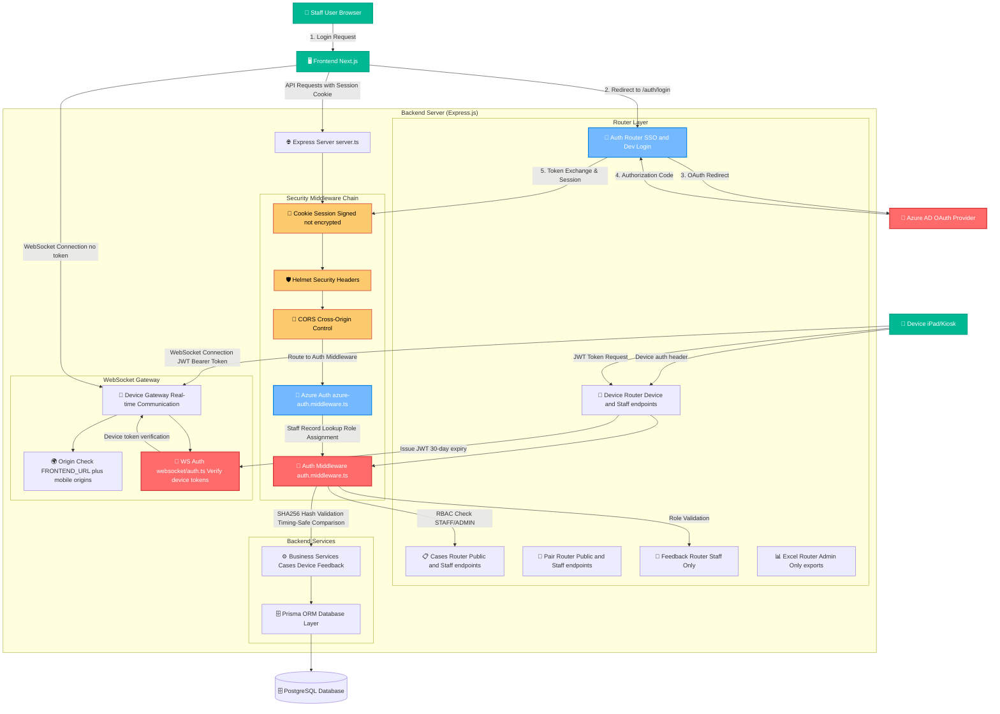

# System Security Architecture

This document provides a comprehensive security diagram of the Real-Time Ticketing System based on the actual implementation in the codebase.

## Security Flow Diagram



## Security Components Breakdown

### 1. Authentication Systems

#### Azure AD OAuth 2.0 (Staff Authentication)
- **Implementation**: `azure-auth.middleware.ts`
- **Flow**: OAuth 2.0 Authorization Code Grant
- **Session Management**: Encrypted cookie sessions with 30-day expiry
- **Staff Record**: Auto-creation on first login with role assignment
- **Caching**: 5-minute TTL for staff record lookups

#### Device Authentication
- **Implementation**: `auth.middleware.ts`, `lib/utils/auth.ts`
- **Format**: `Device <deviceId>:<deviceSecret>`
- **Validation**: SHA256 hash comparison with timing-safe equality
- **Security**: Prevents timing attacks through `crypto.timingSafeEqual()`

#### WebSocket Authentication
- **Implementation**: `websocket/auth.ts` and `websocket/index.ts`
- **Token Type**: JWT with 30-day expiry (devices)
- **Dashboard**: Connections without token are treated as dashboard
- **Origin Policy**: Checked against `FRONTEND_URL` and common mobile origins; dev/test allowed
- **Payload**: Includes deviceId and mode for device tokens

### 2. Authorization & Access Control

#### Role-Based Access Control (RBAC)
```typescript
// Middleware chain for staff endpoints
requireAuth → requireTenant → attachReqUser → requireStaff/requireAdmin
```

- **Roles**: `STAFF`, `ADMIN`
- **Hierarchy**: ADMIN has all STAFF permissions
- **Enforcement**: Middleware-level validation before route handlers

#### Route Protection Patterns
- **Staff Routes**: `requireAuth + requireStaff`
- **Admin Routes**: `requireAuth + requireAdmin` (e.g., `/excel/*` exports)
- **Device Routes**: `requireDevice`
- **Public Routes**: `/cases/public-queue`, `/pair/complete`, `/device/pairing-status/:id`
- **Mixed Routes**: Device and staff endpoints co-exist under `/device`

### 3. Security Middleware Stack

#### 1. Helmet.js
- **Purpose**: Sets standard security headers (Helmet defaults)
- **Note**: No custom CSP configured in code

#### 2. CORS Policy
- **Origin**: Restricted to `FRONTEND_URL`
- **Credentials**: Enabled for cookie-based authentication
- **Methods**: Controlled per route requirements

#### 3. Session Security
- **Type**: Signed cookie sessions (not encrypted)
- **Keys**: Multiple signing keys for rotation via `SESSION_KEYS`
- **Settings**: HttpOnly, SameSite=Lax, Secure in production
- **Proxy Trust**: `app.set("trust proxy", 1)`

### 4. Security Features

#### Input Validation
- **Body Parsing**: Limited to 50MB with URL encoding
- **Parameter Validation**: Runtime checks in controllers; no centralized schema validation
- **SQL Injection**: Prevented through Prisma ORM parameterization

#### Error Handling
- **Custom Errors**: `AuthError`, `BadRequestError`
- **Information Disclosure**: Sanitized error responses
- **Logging**: Structured error logging without sensitive data

#### Development Security
- **Dev Login**: Bypass OAuth for development environment
- **Test Endpoints**: Mock authentication for testing
- **Environment Isolation**: Feature flags for dev/test/production

### 5. Data Protection

#### Database Security
- **ORM**: Prisma with type-safe queries
- **Connection**: Not specified in code; depends on connection string/TLS settings
- **Migrations**: Version-controlled schema changes

#### Session Protection
- **Integrity**: Signed (not encrypted) cookies; client-readable but tamper-proof
- **Rotation**: Multiple keys allow rotation without invalidating sessions
- **Expiry**: `maxAge` 30 days

## Security Validation Points

1. **Authentication Verification**
   - Azure AD token validation with nonce verification
   - Device secret validation with timing-safe comparison
   - JWT signature verification for WebSocket connections

2. **Authorization Checks**
   - Role-based access control at middleware level
   - Tenant validation for multi-tenant support
   - Resource-level permissions where applicable

3. **Session Management**
   - Signed cookie sessions (not encrypted)
   - Automatic session expiry and cleanup
   - Session invalidation on logout

4. **Input Security**
   - Request size limiting to prevent DoS
   - Type validation through TypeScript and runtime checks
   - SQL injection prevention through ORM

This security architecture ensures multi-layered protection with defense in depth, proper authentication and authorization controls, and secure communication channels throughout the system.