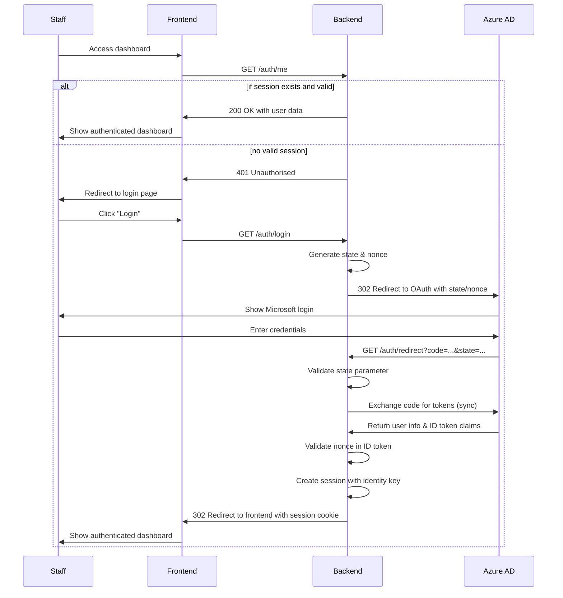
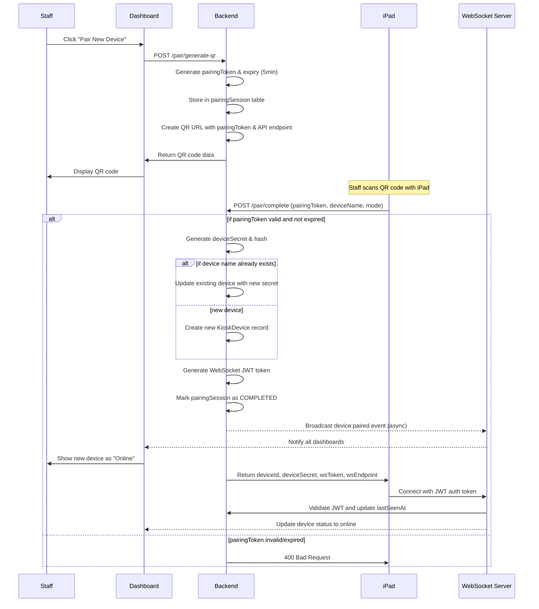
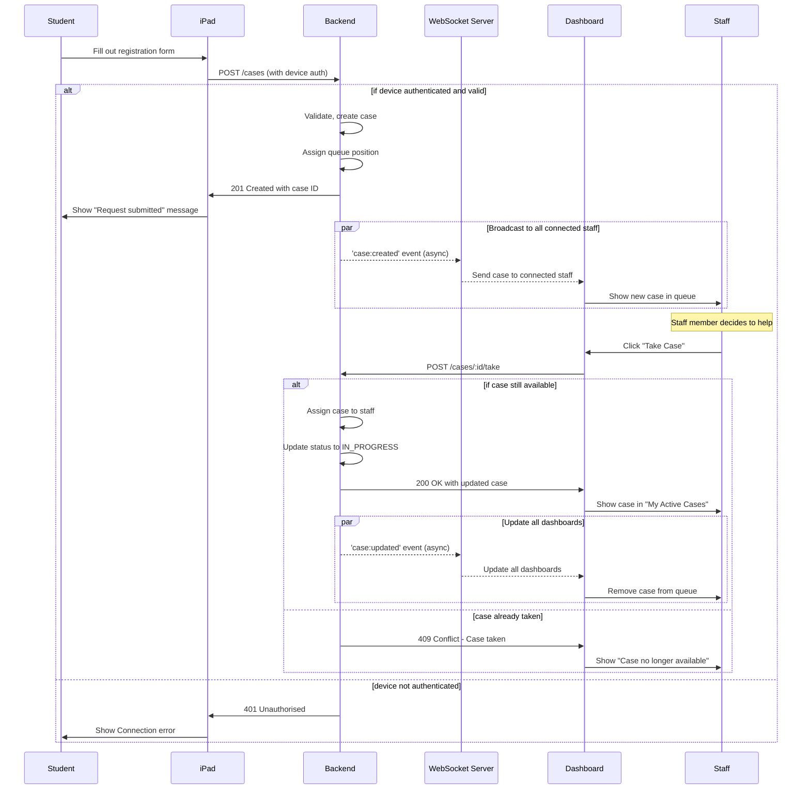
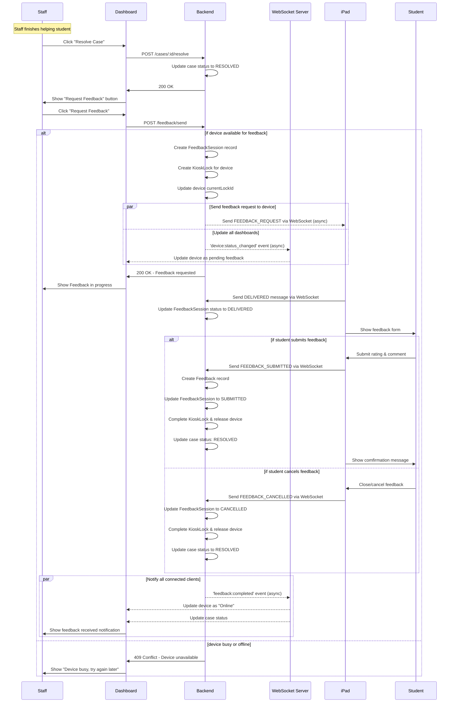
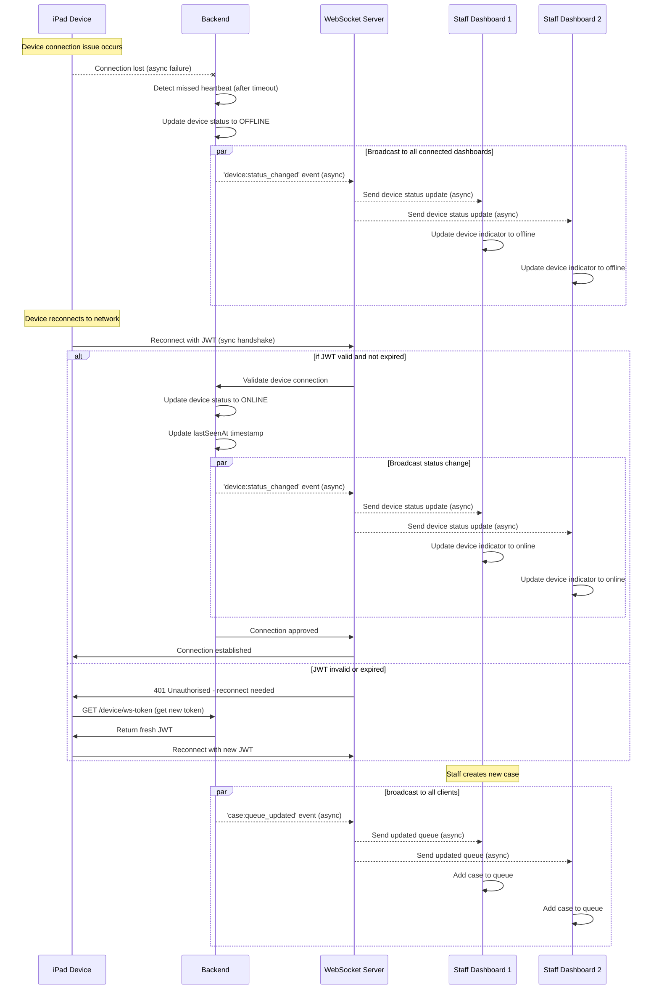
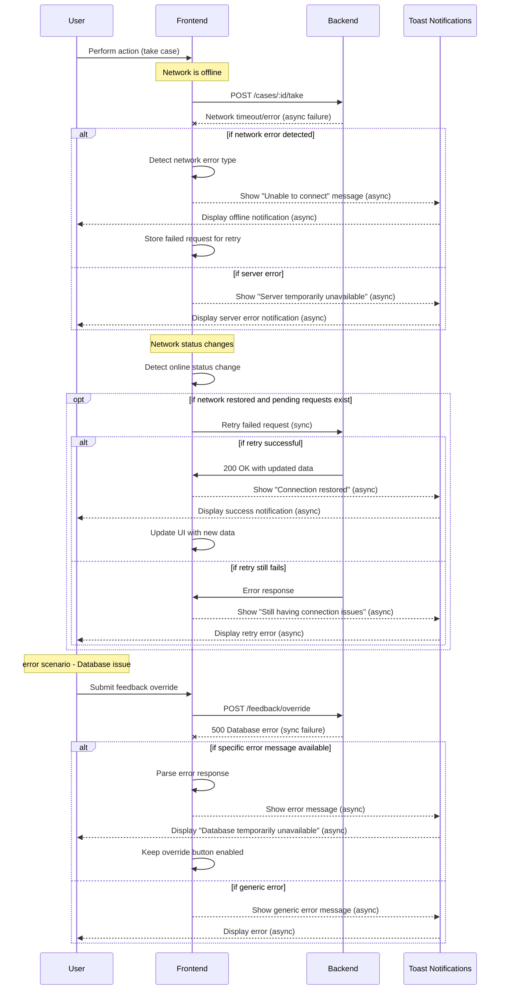
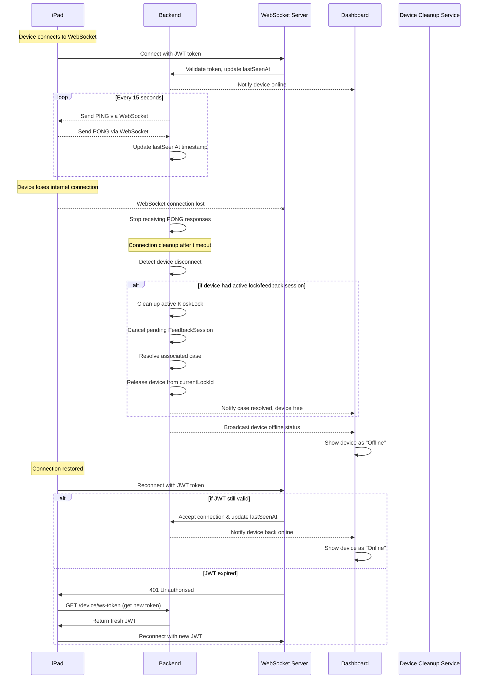
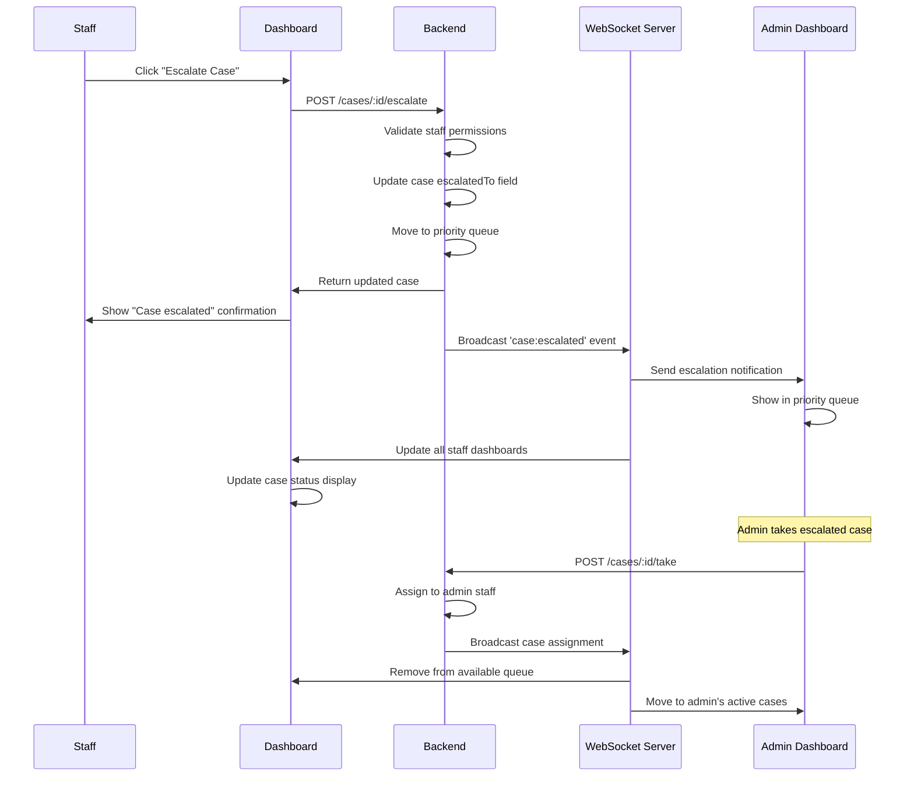
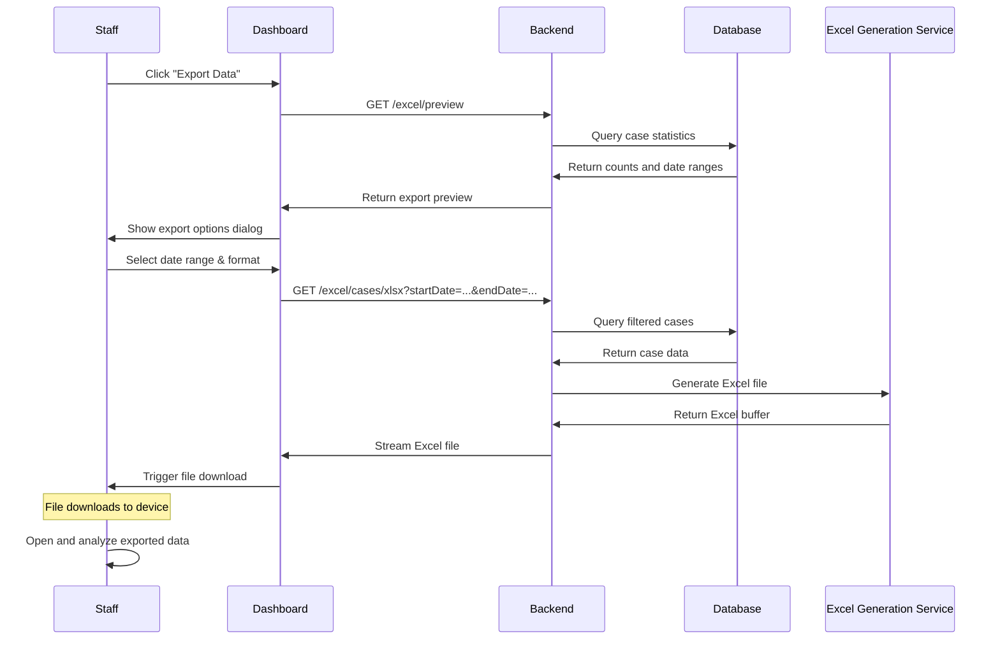

# System Sequence Diagrams

Visualises the key interaction flows in the system, showing how different components communicate with each other

## 1. Staff Authentication Flow

Shows how staff members log in using Azure AD OAuth and establish authenticated sessions.

## 2. Device Pairing Process

Demonstrates how iPad devices are securely paired to the system using QR codes

## 3. Case Creation & Queue Management

Shows the complete flow from student submitting a help request to staff taking the case

## 4. Case Resolution & Feedback Request

Demonstrates how staff resolve cases and request feedback from students

## 5. Real-time Updates via WebSocket

Shows how the system maintains real-time synchronisation across all connected clients

## 6. Error Handling & Network Recovery

Illustrates how the system handles network issues and provides user feedback

## 7. Device Health Monitoring

Shows the continuous health monitoring system for iPad devices

## 8. Case Escalation Process

Demonstrates how cases can be escalated to higher priority queues

## 9. Excel Export Flow

Shows how staff can export case data for reporting and analysis

---
