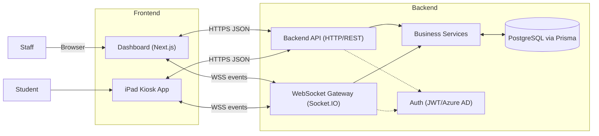
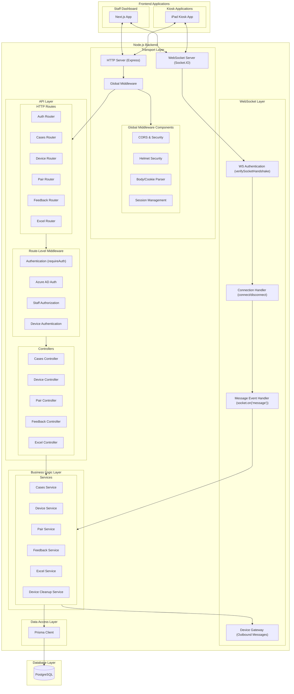

## System Context (Frontend ↔ Backend)

Notes
- Dashboard uses HTTPS for CRUD and subscribes to WSS for real-time updates.
- Kiosk app primarily uses WSS for real-time commands and status.

## Backend Containers & Components

Notes
- **Transport Layer**: Express HTTP server and Socket.IO WebSocket server with comprehensive middleware stack
- **API Layer**: RESTful HTTP routes and controllers for CRUD operations
- **WebSocket Layer**: Real-time communication handling for device management and notifications
- **Business Logic Layer**: Domain services containing core business logic and transaction management
- **Data Access Layer**: Prisma ORM providing type-safe database access
- **Database Layer**: PostgreSQL as the persistent data store

## Current Architecture Issues

1. **WebSocket Handler Direct Database Access**: The WebSocket handler (`src/websocket/index.ts`) currently contains direct Prisma operations, which violates layered architecture principles.

2. **Mixed Responsibilities**: Business logic is scattered between the WebSocket layer and Service layer, making the code harder to maintain and test.