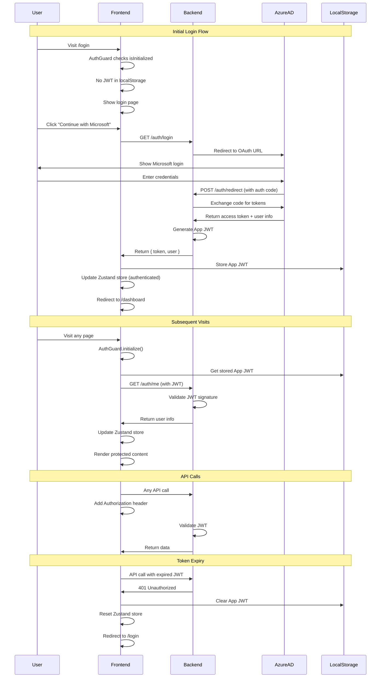
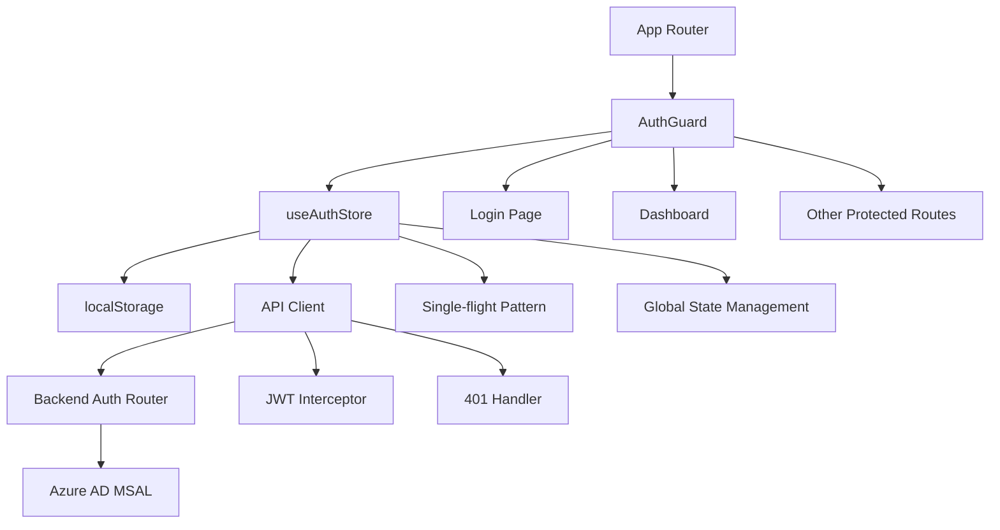
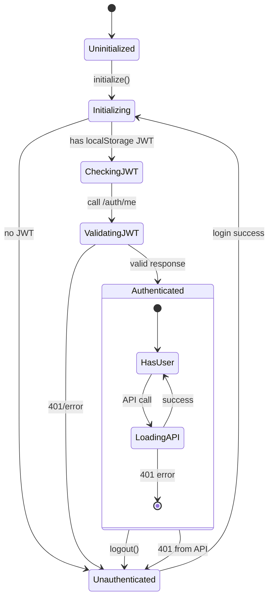

# Authentication Flow Sequence Diagram

## Current SSO Authentication Flow

```mermaid
sequenceDiagram
    participant User
    participant Frontend
    participant Backend
    participant AzureAD
    participant LocalStorage

    Note over User,LocalStorage: Initial Login Flow
    
    User->>Frontend: Visit /login
    Frontend->>Frontend: AuthGuard checks isInitialized
    Frontend->>Frontend: No JWT in localStorage
    Frontend->>Frontend: Show login page
    
    User->>Frontend: Click "Continue with Microsoft"
    Frontend->>Backend: GET /auth/login
    Backend->>AzureAD: Redirect to OAuth URL
    AzureAD->>User: Show Microsoft login
    User->>AzureAD: Enter credentials
    AzureAD->>Backend: POST /auth/redirect (with auth code)
    
    Backend->>AzureAD: Exchange code for tokens
    AzureAD->>Backend: Return access token + user info
    Backend->>Backend: Generate App JWT
    Backend->>Frontend: Return { token, user }
    
    Frontend->>LocalStorage: Store App JWT
    Frontend->>Frontend: Update Zustand store (authenticated)
    Frontend->>Frontend: Redirect to /dashboard
    
    Note over User,LocalStorage: Subsequent Visits
    
    User->>Frontend: Visit any page
    Frontend->>Frontend: AuthGuard.initialize()
    Frontend->>LocalStorage: Get stored App JWT
    Frontend->>Backend: GET /auth/me (with JWT)
    Backend->>Backend: Validate JWT signature
    Backend->>Frontend: Return user info
    Frontend->>Frontend: Update Zustand store
    Frontend->>Frontend: Render protected content
    
    Note over User,LocalStorage: API Calls
    
    Frontend->>Backend: Any API call
    Frontend->>Frontend: Add Authorization header
    Backend->>Backend: Validate JWT
    Backend->>Frontend: Return data
    
    Note over User,LocalStorage: Token Expiry
    
    Frontend->>Backend: API call with expired JWT
    Backend->>Frontend: 401 Unauthorized
    Frontend->>LocalStorage: Clear App JWT
    Frontend->>Frontend: Reset Zustand store
    Frontend->>Frontend: Redirect to /login
```

## Component Architecture

```mermaid
graph TD
    A[App Router] --> B[AuthGuard]
    B --> C[useAuthStore]
    C --> D[localStorage]
    C --> E[API Client]
    E --> F[Backend Auth Router]
    F --> G[Azure AD MSAL]
    
    B --> H[Login Page]
    B --> I[Dashboard]
    B --> J[Other Protected Routes]
    
    C --> K[Single-flight Pattern]
    C --> L[Global State Management]
    
    E --> M[JWT Interceptor]
    E --> N[401 Handler]
```

## State Management Flow

```mermaid
stateDiagram-v2
    [*] --> Uninitialized
    Uninitialized --> Initializing: initialize()
    Initializing --> CheckingJWT: has localStorage JWT
    Initializing --> Unauthenticated: no JWT
    
    CheckingJWT --> ValidatingJWT: call /auth/me
    ValidatingJWT --> Authenticated: valid response
    ValidatingJWT --> Unauthenticated: 401/error
    
    Authenticated --> Unauthenticated: logout()
    Authenticated --> Unauthenticated: 401 from API
    
    Unauthenticated --> Initializing: login success
    
    state Authenticated {
        [*] --> HasUser
        HasUser --> LoadingAPI: API call
        LoadingAPI --> HasUser: success
        LoadingAPI --> [*]: 401 error
    }
```
