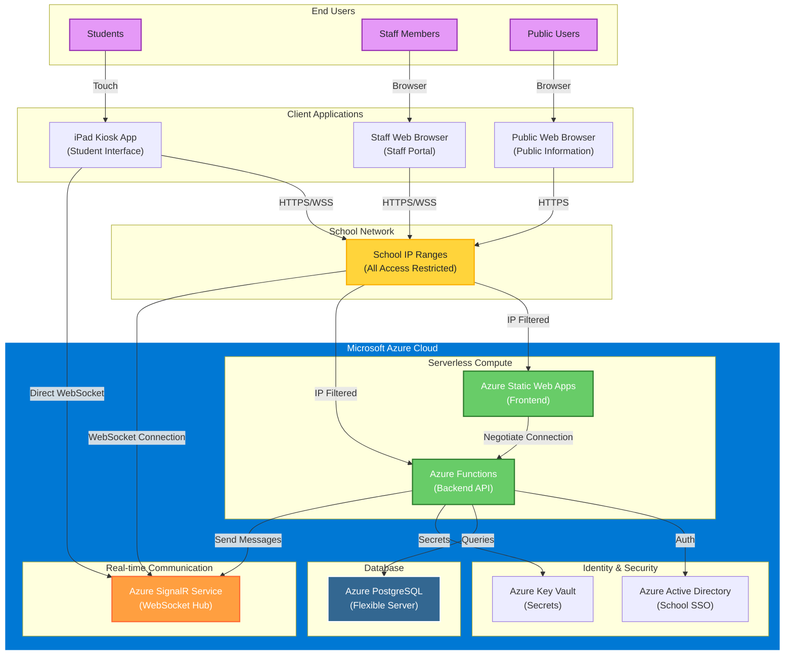

## Network Flow Diagram

```mermaid
flowchart TD
  %% Users
  subgraph Users["End Users"]
    Students["Students"]
    Staff["Staff Members"]
    PublicUsers["Public Users"]
  end

  %% Client Applications
  subgraph ClientApps["Client Applications"]
    iPadApp["iPad Kiosk App<br/>(Student Interface)"]
    StaffBrowser["Staff Web Browser<br/>(Staff Portal)"]
    PublicBrowser["Public Web Browser<br/>(Public Information)"]
  end

  %% Network
  subgraph Network["School Network"]
    SchoolNetwork["School IP Ranges<br/>(All Access Restricted)"]
  end

  %% Azure Services
  subgraph Azure["Microsoft Azure Cloud"]
    subgraph Compute["Serverless Compute"]
      BackendFunc["Azure Functions<br/>(Backend API)"]
      FrontendApp["Azure Static Web Apps<br/>(Frontend)"]
    end
    
    subgraph RealTime["Real-time Communication"]
      SignalR["Azure SignalR Service<br/>(WebSocket Hub)"]
    end
    
    subgraph Database["Database"]
      AzurePostgreSQL["Azure PostgreSQL<br/>(Flexible Server)"]
    end
    
    subgraph Identity["Identity & Security"]
      AzureAD["Azure Active Directory<br/>(School SSO)"]
      KeyVault["Azure Key Vault<br/>(Secrets)"]
    end
  end

  %% Connections
  Students -->|Touch| iPadApp
  Staff -->|Browser| StaffBrowser
  PublicUsers -->|Browser| PublicBrowser

  iPadApp -->|HTTPS/WSS| SchoolNetwork
  StaffBrowser -->|HTTPS/WSS| SchoolNetwork
  PublicBrowser -->|HTTPS| SchoolNetwork

  SchoolNetwork -->|IP Filtered| FrontendApp
  SchoolNetwork -->|IP Filtered| BackendFunc
  SchoolNetwork -->|WebSocket Connection| SignalR

  BackendFunc -->|Auth| AzureAD
  BackendFunc -->|Queries| AzurePostgreSQL
  BackendFunc -->|Secrets| KeyVault
  BackendFunc -->|Send Messages| SignalR
  
  FrontendApp -->|Negotiate Connection| BackendFunc
  iPadApp -->|Direct WebSocket| SignalR

  %% Styling
  classDef azure fill:#0078d4,stroke:#ffffff,stroke-width:2px,color:#ffffff
  classDef realtime fill:#ff9f40,stroke:#ff6b35,stroke-width:2px,color:#ffffff
  classDef compute fill:#68cc68,stroke:#2e7d2e,stroke-width:2px,color:#ffffff
  classDef database fill:#336791,stroke:#ffffff,stroke-width:2px,color:#ffffff
  classDef network fill:#ffd43b,stroke:#fab005,stroke-width:2px,color:#212529
  classDef users fill:#e599f7,stroke:#9c36b5,stroke-width:2px,color:#212529
  
  class Azure azure
  class BackendFunc,FrontendApp compute
  class SignalR realtime
  class AzurePostgreSQL database
  class SchoolNetwork network
  class Students,Staff,PublicUsers users
```
